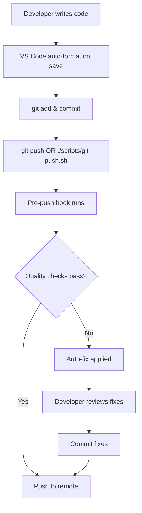
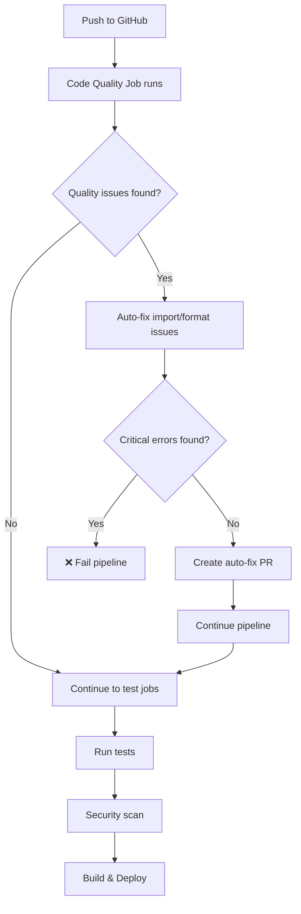

# 🤖 Automated Code Quality Enforcement

This document explains the comprehensive automated code quality enforcement system for the Bird-Bone AI project, which ensures code quality standards are maintained at multiple levels.

## 📋 Overview

The enforcement system operates at **three levels**:

1. **🛡️ Local Development** - Pre-push hooks and VS Code integration
2. **🔄 CI/CD Pipeline** - GitHub Actions with auto-fixing
3. **🚫 Blocking Controls** - Critical errors that stop the pipeline

## 🎯 Quality Standards Enforced

### 1. Import Sorting (isort)
- **Tool**: `isort`
- **Auto-fix**: ✅ Yes
- **Blocking**: ❌ No (warnings only)
- **Configuration**: Black-compatible profile

### 2. Code Formatting (black)
- **Tool**: `black`
- **Auto-fix**: ✅ Yes  
- **Blocking**: ❌ No (auto-fixed)
- **Configuration**: 88 character line length

### 3. Critical Linting (flake8)
- **Tool**: `flake8`
- **Auto-fix**: ❌ No
- **Blocking**: ✅ Yes
- **Scope**: Only critical errors (E9, F63, F7, F82)

#### Critical Error Types (Blocking):
- **E9**: Syntax errors
- **F63**: Invalid syntax in type annotations  
- **F7**: Logic errors
- **F82**: Undefined names

## 🔄 Enforcement Workflow

### Local Development Flow



### CI/CD Pipeline Flow



## 🛠️ Setup Instructions

### Quick Setup (Recommended)

Run the automated setup script:

```bash
./scripts/setup-quality-enforcement.sh
```

This will configure:
- ✅ Git pre-push hooks
- ✅ VS Code integration  
- ✅ NPM-style scripts
- ✅ All required dependencies

### Manual Setup

1. **Install dependencies:**
   ```bash
   pip install black isort flake8 pytest pytest-cov
   ```

2. **Install git hooks:**
   ```bash
   cp scripts/pre-push.sh .git/hooks/pre-push
   chmod +x .git/hooks/pre-push
   ```

3. **Make scripts executable:**
   ```bash
   chmod +x scripts/*.sh
   ```

## 🚀 Usage Commands

### NPM-Style Scripts

| Command | Description |
|---------|-------------|
| `./scripts/run.sh quality` | Run all quality checks |
| `./scripts/run.sh lint` | Run linting only |
| `./scripts/run.sh lint:fix` | Auto-fix linting issues |
| `./scripts/run.sh format` | Format code with black |
| `./scripts/run.sh imports` | Sort imports with isort |
| `./scripts/git-push.sh` | Git push with quality checks |
| `./scripts/git-push.sh --force` | Force push with quality checks |
| `./scripts/git-push.sh --skip-checks` | Push without quality checks |

### Git Integration

**Instead of:** `git push origin main`  
**Use:** `./scripts/git-push.sh origin main`

This ensures quality checks run before every push.

## 🤖 CI/CD Automation Features

### Automatic Pull Request Creation

When the CI/CD pipeline detects fixable quality issues on push, it will:

1. **Auto-fix** import sorting and code formatting
2. **Create a Pull Request** with the fixes
3. **Label** the PR appropriately (`automated`, `code-quality`, `style`)
4. **Continue** the pipeline with the fixed code

### Quality Report Comments

On Pull Requests, the pipeline adds a detailed quality report comment:

```markdown
# 📊 Code Quality Report

## 🔍 Import Sorting (isort)
✅ **Passed** - All imports are properly sorted

## 🎨 Code Formatting (black)  
✅ **Passed** - Code is properly formatted

## 🚨 Critical Linting (flake8)
✅ **Passed** - No critical linting errors

## 📋 Full Linting Report
```
style warnings report...
```
```

### Blocking Critical Errors

The pipeline will **fail** and **block merging** if critical linting errors are found:

- ❌ **E9**: Syntax errors
- ❌ **F63**: Invalid syntax in type annotations
- ❌ **F7**: Logic errors
- ❌ **F82**: Undefined names

## 🔧 VS Code Integration

### Auto-Format on Save

The setup configures VS Code to:
- ✅ Format code with `black` on save
- ✅ Sort imports with `isort` on save
- ✅ Run `flake8` linting in real-time
- ✅ Trim trailing whitespace
- ✅ Insert final newline

### Tasks Integration

VS Code tasks are available via `Ctrl+Shift+P` > "Tasks: Run Task":

- **Quality Check** - Run all quality checks
- **Format Code** - Auto-fix all formatting
- **Git Push with Quality Checks** - Push with enforcement

## 📊 Monitoring and Reporting

### Artifacts and Reports

The CI/CD pipeline generates:

- **Code Quality Reports** - Detailed analysis
- **Coverage Reports** - Test coverage metrics  
- **Security Scan Results** - Bandit security analysis
- **Build Artifacts** - Deployable packages

### GitHub Actions Dashboard

Monitor enforcement status in:
- **Actions tab** - Pipeline execution status
- **Pull Requests** - Quality report comments
- **Commit statuses** - Pass/fail indicators

## 🚫 Bypassing Enforcement (Not Recommended)

### Skip Local Checks

```bash
# Skip pre-push hook (not recommended)
git push --no-verify

# Skip quality checks in git-push script
./scripts/git-push.sh --skip-checks
```

### Emergency Override

For critical hotfixes, you can:

1. **Skip local checks** with `--no-verify`
2. **Create a follow-up PR** to fix quality issues
3. **Use the auto-fix PR** created by CI/CD

## 🛟 Troubleshooting

### Common Issues

**Pre-push hook not running:**
```bash
# Reinstall the hook
cp scripts/pre-push.sh .git/hooks/pre-push
chmod +x .git/hooks/pre-push
```

**VS Code not auto-formatting:**
- Check `.vscode/settings.json` exists
- Ensure Python extension is installed
- Verify `black` and `isort` are available

**CI/CD pipeline failing:**
- Check for critical linting errors
- Review the quality report in PR comments
- Fix syntax errors manually

### Getting Help

1. **Check documentation** in `docs/` directory
2. **Review CI/CD logs** in GitHub Actions
3. **Run local quality checks** with `./scripts/run.sh quality`

## 🎉 Benefits

### For Developers
- ✅ **Consistent code style** across the project
- ✅ **Automatic fixing** of common issues
- ✅ **Real-time feedback** in VS Code
- ✅ **Reduced review time** for style issues

### For the Project
- ✅ **Higher code quality** standards
- ✅ **Reduced bugs** from syntax/logic errors
- ✅ **Improved readability** and maintainability
- ✅ **Automated compliance** with coding standards

---

## 📚 Related Documentation

- [Git Push Implementation Summary](git-push-implementation-summary.md)
- [Git Push Quality Checks](git-push-quality-checks.md)
- [ModuLink Best Practices](modulink-best-practices.md)

---

*This automated enforcement system ensures that code quality is maintained consistently across all development workflows, from local development to production deployment.*
